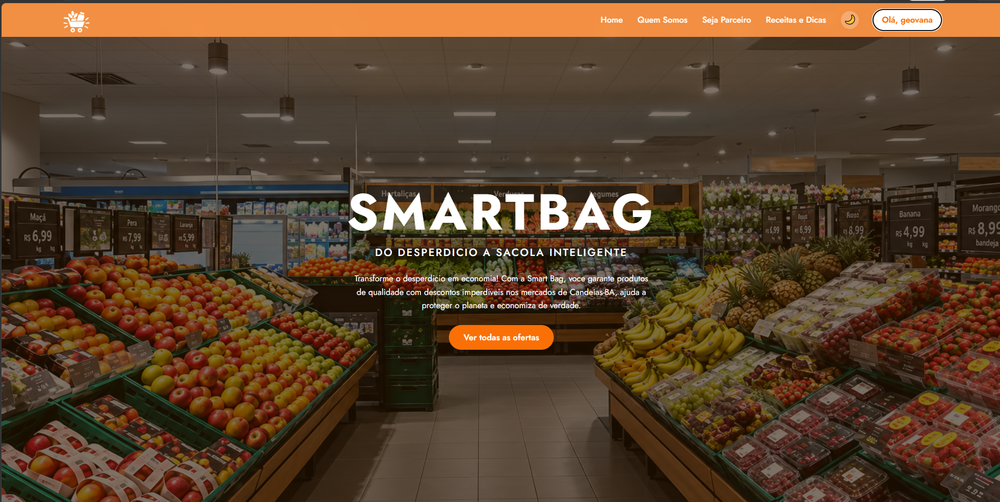
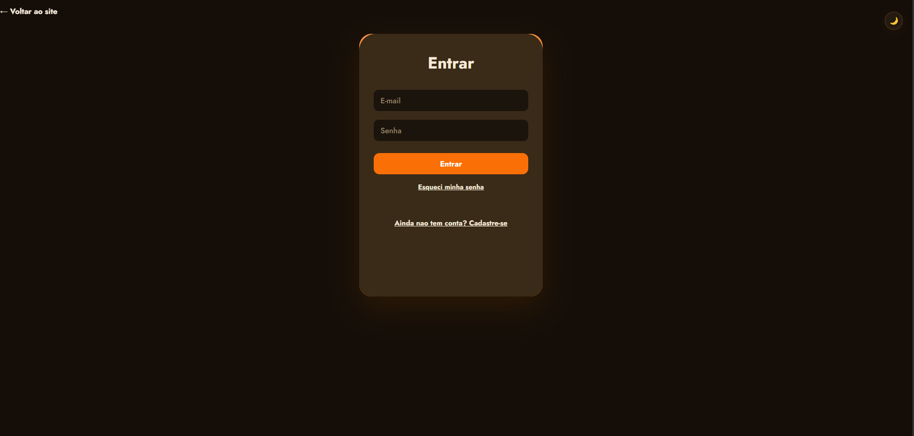
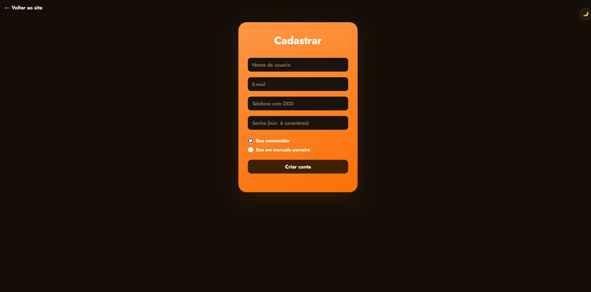
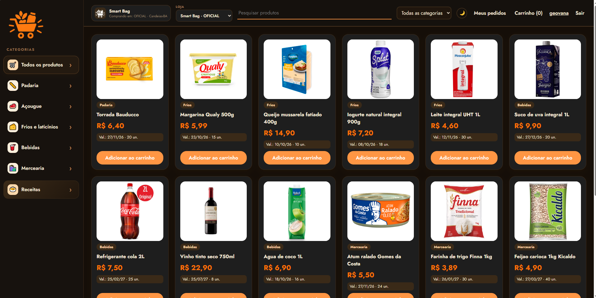
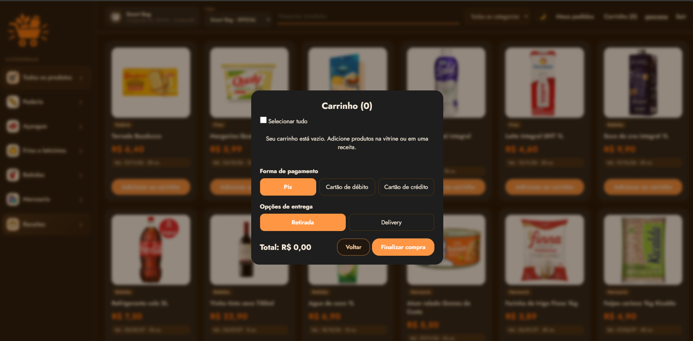
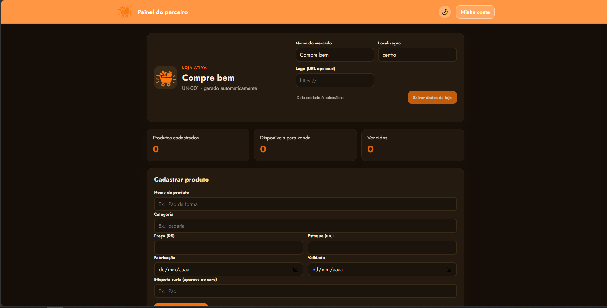

# Smart Bag

Do desperdício à sacola inteligente. Plataforma que conecta supermercados de Candeias-BA a consumidores, oferecendo produtos próximos da validade com desconto — projeto nascido no SENAI Candeias.

## Descrição da aplicação

O **Smart Bag** é uma aplicação web full-stack com três perfis de uso em um só sistema:

- **Consumidor:** navega pelo catálogo, filtra por categoria, pesquisa por nome, monta o carrinho, finaliza a compra (Pix, débito ou crédito; retirada ou delivery) e acompanha o histórico de pedidos, podendo cancelar os que ainda não foram entregues.
- **Parceiro (mercado/comércio local):** cadastra e gerencia o próprio estoque de produtos com desconto (criar, editar e excluir), acompanhando quantos itens estão disponíveis e quantos já venceram.
- **Visitante:** conhece a proposta, entende como funciona e envia mensagens pelo formulário de contato.

## Objetivo

Reduzir o desperdício de alimentos em Candeias-BA, dando visibilidade e um canal de venda rápido para produtos com validade próxima, ao mesmo tempo em que consumidores economizam no dia a dia.

## Tecnologias utilizadas

| Camada | Tecnologia |
|---|---|
| Front-end | HTML5, CSS3, JavaScript (Vanilla, sem framework), Vite |
| Back-end | Node.js, Express |
| Comunicação | Fetch API (JSON), autenticação por token (Bearer) |
| Persistência | Arquivo de dados estruturado (`database/data.json`), com o modelo relacional equivalente documentado em `database/schema.sql` |
| Ferramentas | npm, concurrently (roda front e back juntos em desenvolvimento) |

## Como instalar e executar

**Pré-requisitos:** [Node.js 20 ou superior](https://nodejs.org/) e [Git](https://git-scm.com/).

### 1. Clonar o repositório

```bash
git clone https://github.com/geos-droid/Projeto_SmartBag.git
cd Projeto_SmartBag
```

### 2. Instalar as dependências

```bash
npm install
```

### 3. Executar (Front-end + Back-end juntos)

```bash
npm run dev
```

| Parte | Endereço |
|---|---|
| Front-end | http://localhost:5173 |
| Back-end (API) | http://127.0.0.1:3001 |
| Teste de saúde da API | http://127.0.0.1:3001/api/health |

O Vite encaminha automaticamente as chamadas `/api/...` do front-end para o back-end.

### Executar cada parte separadamente

```bash
npm run backend    # somente a API (porta 3001)
npm run frontend   # somente o front-end (porta 5173)
```
### Versão de produção

```bash
npm run build      # gera os arquivos estáticos em dist/
npm run backend    # o back-end também serve o front-end buildado
```

### Banco de dados

O sistema funciona imediatamente com `database/data.json` (já com 24 produtos de exemplo). O modelo relacional equivalente está em `database/schema.sql`, e os dados iniciais em `database/seed.sql`:

```bash
sqlite3 smartbag.db < database/schema.sql
sqlite3 smartbag.db < database/seed.sql
```

## Estrutura do projeto

```
Projeto_SmartBag/
├── frontend/       Páginas (home, login/cadastro, dashboard, painel do parceiro, minha conta), CSS e JS
├── backend/
│   └── src/
│       ├── server.js        Servidor Express e tratador global de erros
│       ├── store.js         Camada de acesso aos dados
│       ├── middleware/      Autenticação (login e perfil de parceiro)
│       └── routes/          auth, products, orders, markets, contact
├── database/       schema.sql, seed.sql e data.json
├── assets/         Logos e imagens
├── docs/           Documentação técnica completa
├── README.md
└── package.json
```

## Funcionalidades principais

- **Login e cadastro** com dois tipos de conta (consumidor e parceiro), senha com hash e sessão por token
- **Catálogo de produtos** com busca por nome e filtro por categoria, exibindo validade e estoque
- **Carrinho de compras** com seleção de itens, forma de pagamento e opção de entrega (retirada ou delivery)
- **Checkout validado no servidor:** o total é recalculado pelos preços do banco, com conferência de estoque e validade
- **Histórico de pedidos** com cancelamento (o estoque volta automaticamente)
- **Painel do parceiro:** CRUD completo de produtos e edição do perfil da loja
- **Minha conta:** editar nome/telefone ou excluir a própria conta
- **Fale conosco** com validação de campos
- **Modo escuro** em todas as páginas, com preferência salva no navegador
- **Layout responsivo** para celular, tablet e desktop

## Telas do sistema

| Página inicial | Login | Cadastro |
|---|---|---|
|  |  |  |

| Vitrine / Dashboard | Carrinho | Painel do parceiro |
|---|---|---|
|  |  |  |


## Integrantes da equipe

>
- Ana Caroline de Oliveira Ferreira
- Geovana de Santana dos Santos
- Larissa Oliveira da Silva
- Paulo Aldo de Oliveira Neto
- Yasmin Santos Ribeiro

## Instituição

SENAI Candeias

## Professor orientador

Adalberto Santana

## Documentação completa

Veja a pasta [`docs/`](docs/): `DOCUMENTO_DO_SISTEMA.md` (documento completo do sistema), `ARCHITECTURE.md` (arquitetura) e `API.md` (referência dos endpoints).
