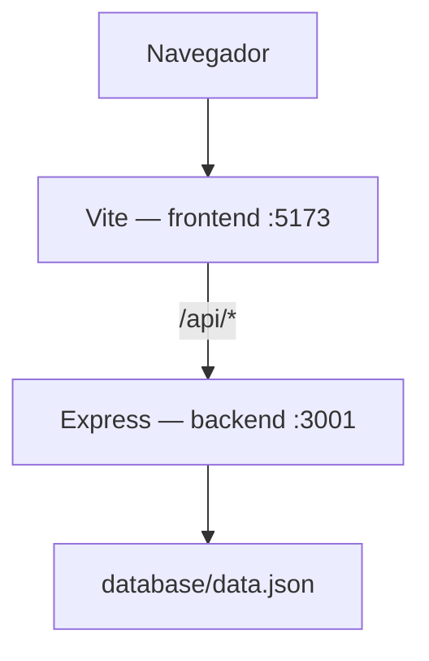
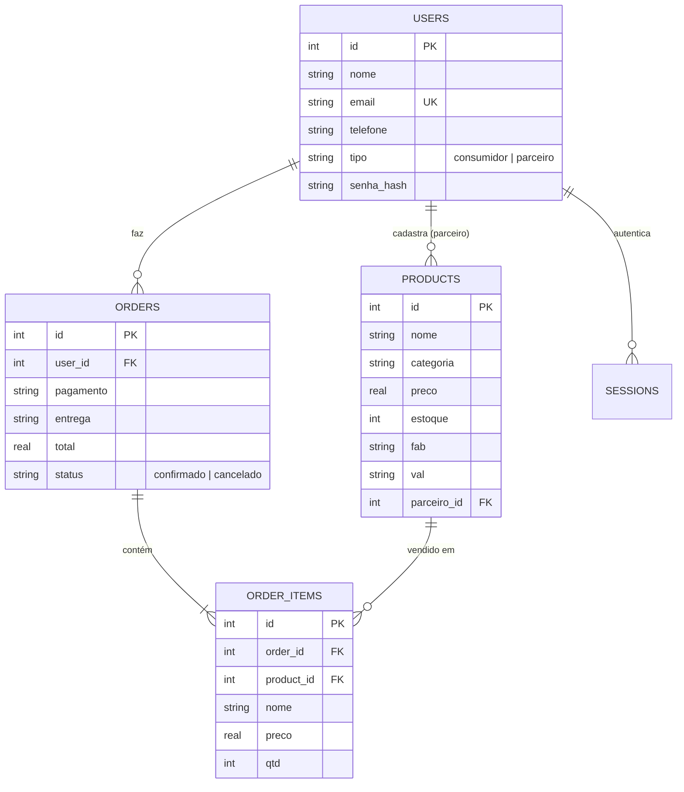

# Arquitetura — Smart Bag

## Visão geral

Em desenvolvimento, o Vite serve o front-end na porta 5173 e encaminha toda chamada iniciada em `/api` para o back-end na porta 3001 (proxy configurado em `vite.config.js`). Em produção, `npm run build` gera os arquivos estáticos em `frontend/dist`, e o próprio Express passa a servi-los junto com a API, em uma porta só.

## Pastas

- `frontend/` — páginas HTML, CSS e JS puro (sem framework), uma página por finalidade
- `backend/src/` — API Express
  - `server.js` — ponto de entrada, liga as rotas
  - `routes/` — uma rota por recurso (`auth`, `products`, `orders`, `contact`)
  - `middleware/auth.js` — confere o token de sessão e o tipo de conta
  - `store.js` — camada de acesso a dados: cada função equivale ao que uma tabela SQL faria
- `database/` — `schema.sql` (modelo relacional), `seed.sql` (catálogo inicial) e `data.json` (dados em uso pelo `store.js`)
- `assets/` — logo e imagens públicas
- `docs/` — esta documentação

## Modelo de dados

Ver definição completa em `database/schema.sql`.

## Autenticação

Login por e-mail/senha (senha guardada como hash SHA-256). No login, o servidor gera um token aleatório e devolve ao front-end, que o guarda em `sessionStorage` (dura só a visita atual) e o envia em cada chamada protegida no cabeçalho `Authorization: Bearer <token>`. Rotas que exigem login usam o middleware `exigirLogin`; as exclusivas de parceiro usam `exigirParceiro`, que também confere `tipo === 'parceiro'`.

## Endpoints

| Método | Rota | Descrição | Protegida |
|---|---|---|---|
| GET | `/api/health` | Verifica se a API está no ar | — |
| POST | `/api/auth/register` | Cria conta (consumidor ou parceiro) | — |
| POST | `/api/auth/login` | Autentica e devolve o token de sessão | — |
| POST | `/api/auth/logout` | Encerra a sessão | login |
| GET | `/api/auth/me` | Dados do usuário logado | login |
| PUT | `/api/auth/me` | Atualiza nome/telefone | login |
| DELETE | `/api/auth/me` | Exclui a própria conta | login |
| GET | `/api/products?q=&categoria=` | Catálogo público (ativos, com estoque, na validade) | — |
| GET | `/api/products/mine` | Produtos do parceiro logado (todos, inclusive vencidos) | parceiro |
| GET | `/api/products/:id` | Detalhe de um produto | — |
| POST | `/api/products` | Cadastra produto | parceiro |
| PUT | `/api/products/:id` | Edita produto (só o dono) | parceiro |
| DELETE | `/api/products/:id` | Exclui produto (só o dono) | parceiro |
| POST | `/api/orders` | Cria pedido (confere estoque/validade e desconta) | login |
| GET | `/api/orders` | Histórico do usuário logado | login |
| DELETE | `/api/orders/:id` | Cancela pedido confirmado (repõe estoque) | login |
| POST | `/api/contact` | Envia mensagem de contato | — |

Referência de campos e exemplos em `docs/API.md`.
