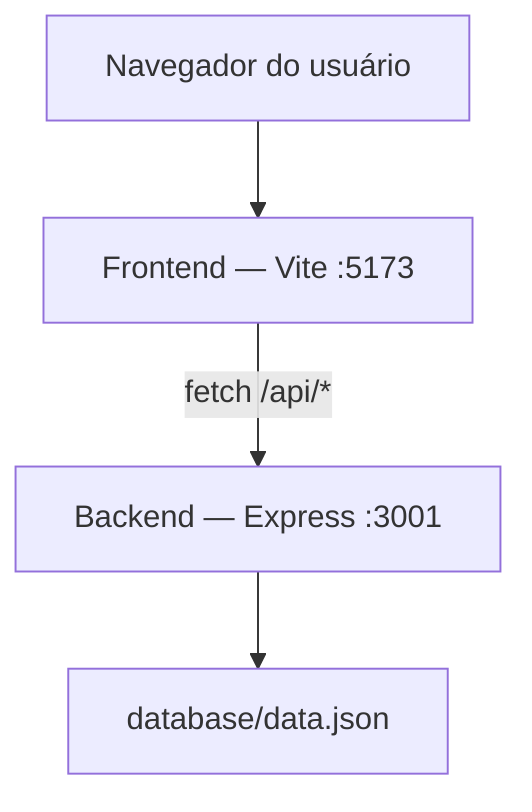
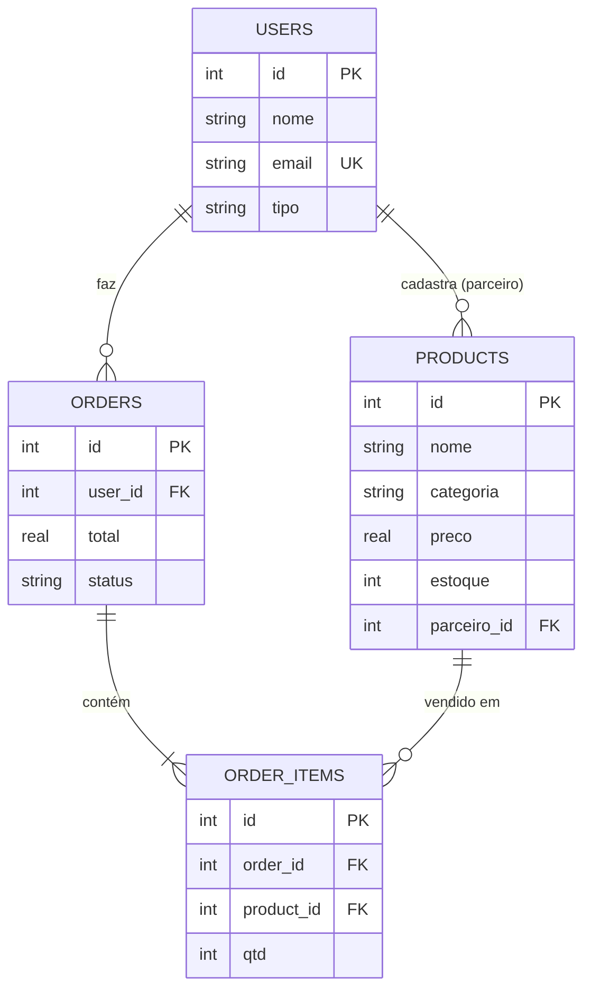
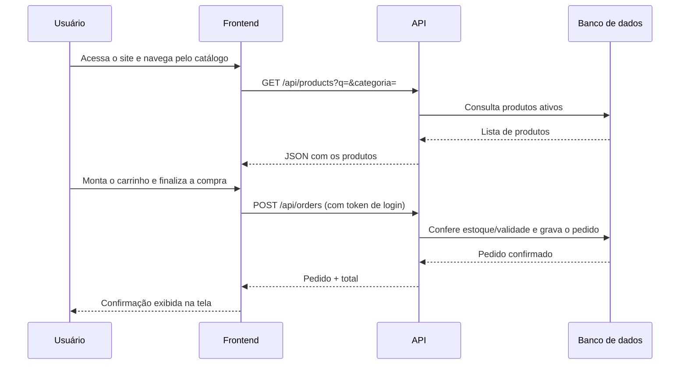

# Documento do Sistema — Smart Bag

## Capa

- **Sistema:** Smart Bag — Do desperdício à sacola inteligente
- **Equipe:** *Ana Caroline, Geovana, Larissa, Paulo Aldo e Yasmin*
- **Instituição:** SENAI Candeias
- **Professor orientador:** Adalberto Santana
- **Versão:** v1.0 — versão final para apresentação

## Integrantes da equipe

*Ana Caroline, Geovana, Larissa, Paulo Aldo e Yasmim*

## Descrição do projeto

O Smart Bag é uma plataforma web criada para aproximar mercados e comércios locais de consumidores interessados em produtos com validade próxima e preços reduzidos. O sistema reúne área institucional, vitrine de produtos, carrinho e checkout, histórico de pedidos, conta do consumidor e painel de parceiro para gerenciamento do estoque.

A proposta é transformar produtos que poderiam ser descartados em oportunidades de venda. O sistema também possui receitas e dicas de aproveitamento relacionadas aos produtos disponíveis.

## Problema identificado

O problema central é o desperdício de alimentos causado pela perda de prazos de validade e por falhas de gestão e armazenamento nos mercados de Candeias-BA. O documento-base destaca a ausência de práticas como PEPS (Primeiro a Entrar, Primeiro a Sair) como um fator relacionado à perda de produtos por vencimento. 

## Objetivo da solução

Combater o desperdício de alimentos em mercados. O objetivo específico é implementar o Smart Bag como plataforma para dar visibilidade e facilitar a venda de produtos próximos ao vencimento, permitindo que os estabelecimentos convertam parte das perdas em receita e que consumidores encontrem alimentos por preços mais acessíveis. 

## Público-alvo

- **Consumidores** de Candeias-BA que quiram economizar nas compras do dia a dia.
- **Supermercados, mercearias, açougues, padarias e comércios locais** que queiram reduzir perdas de estoque.

## Justificativa do projeto

O projeto se justifica pela necessidade de enfrentar o desperdício de alimentos e seus impactos econômicos, sociais e ambientais. O Smart Bag propõe uma alternativa tecnológica para dar saída a produtos próximos da validade, transformando possíveis perdas em vendas e ampliando o acesso do consumidor a produtos por preços mais acessíveis.

A proposta também inclui receitas e dicas de aproveitamento para facilitar a compra e conscientizar os usuários sobre o combate ao desperdício.

## Tecnologias utilizadas

- **Front-end:** HTML5, CSS3, JavaScript (Vanilla), Vite
- **Back-end:** Node.js, Express
- **Comunicação:** Fetch API, autenticação por token
- **Persistência de dados:** arquivo estruturado (`data.json`), com modelo relacional documentado em SQL
- **Controle de versão:** Git/GitHub

## Arquitetura da aplicação



O front-end (páginas estáticas + JavaScript) roda separado do back-end (API REST). A comunicação acontece só por `fetch`, em JSON, nunca por recarregamento de página. Ver detalhes em `docs/ARCHITECTURE.md`.

## Estrutura do projeto

```
Projeto/
├── frontend/   index, login, dashboard, painel do parceiro, minha conta (HTML + CSS + JS)
├── backend/    API Express (rotas, middleware de autenticação, camada de dados)
├── database/   schema.sql, seed.sql, data.json
├── assets/     logo e imagens
├── docs/       esta documentação
├── README.md
└── package.json
```

## Modelo do banco de dados



Definição completa das tabelas, tipos e restrições em `database/schema.sql`.

## Principais funcionalidades

1. Cadastro e login (consumidor ou parceiro)
2. Catálogo com busca e filtro por categoria
3. Carrinho de compras e checkout (Pix, débito, crédito · retirada ou delivery)
4. Histórico de pedidos, com cancelamento
5. Painel do parceiro: CRUD completo de produtos
6. Edição de perfil e exclusão de conta
7. Formulário de contato
8. Modo escuro
9. Layout responsivo (celular, tablet, desktop)

## Requisitos funcionais

| Código | Requisito |
|---|---|
| RF01 | O sistema deve permitir cadastro e login de usuários (consumidor ou parceiro) |
| RF02 | O sistema deve listar produtos ativos, com estoque e dentro da validade |
| RF03 | O sistema deve permitir busca por nome e filtro por categoria |
| RF04 | O sistema deve permitir montar um carrinho e finalizar a compra |
| RF05 | O sistema deve conferir estoque e validade no servidor antes de confirmar um pedido |
| RF06 | O sistema deve exibir o histórico de pedidos do usuário logado |
| RF07 | O sistema deve permitir cancelar um pedido confirmado e repor o estoque |
| RF08 | O sistema deve permitir que um parceiro cadastre, edite e exclua seus próprios produtos |
| RF09 | O sistema deve permitir editar dados do perfil e excluir a conta |
| RF10 | O sistema deve permitir enviar uma mensagem de contato |

## Requisitos não funcionais

| Código | Requisito |
|---|---|
| RNF01 | A interface deve ser responsiva para celular, tablet e desktop |
| RNF02 | As senhas devem ser armazenadas com hash, nunca em texto puro |
| RNF03 | Toda operação de escrita deve validar os dados tanto no front quanto no back-end |
| RNF04 | O sistema deve informar mensagens de erro e sucesso claras ao usuário |
| RNF05 | A comunicação entre front e back deve usar exclusivamente Fetch API/JSON |
| RNF06 | O código deve ser organizado por responsabilidade (rotas, middleware, camada de dados) |

## Fluxo de funcionamento do sistema



## Imagens das telas

> Adicione os prints em `docs/imagens/` e referencie-os aqui, por exemplo:
> ``

- [ ] Página inicial (Home)
- [ ] Login e cadastro
- [ ] Dashboard / vitrine de produtos
- [ ] Carrinho e checkout
- [ ] Histórico de pedidos
- [ ] Painel do parceiro (CRUD de produtos)
- [ ] Minha conta

## Melhorias implementadas (evolução em relação à primeira versão)

A primeira versão do projeto era uma landing page estática, sem back-end nem persistência de dados. A partir dela, a equipe evoluiu o sistema para:

- Back-end próprio em Node.js/Express, com rotas organizadas por recurso
- Autenticação real (cadastro, login, sessão por token, dois tipos de conta)
- Banco de dados estruturado, com relacionamento entre usuários, produtos e pedidos
- CRUD completo de produtos, exclusivo para contas de parceiro
- Checkout com conferência real de estoque e validade no servidor
- Histórico de pedidos com cancelamento
- Edição e exclusão de conta
- Modo escuro
- Ajustes de responsividade para tablet

Ver histórico detalhado em `docs/CHANGELOG.md`.

## Possíveis evoluções futuras

- Integração com um provedor de pagamento real (Pix/cartão) em vez de apenas registrar a forma escolhida
- Papel de administrador para moderar parceiros e mensagens de contato
- Notificações por e-mail quando um produto está perto de vencer
- Avaliações e comentários dos consumidores sobre os produtos
- Relatórios e gráficos de vendas para o parceiro
- Migração de `data.json` para um banco de dados relacional (SQLite/PostgreSQL), usando o `schema.sql` já preparado
