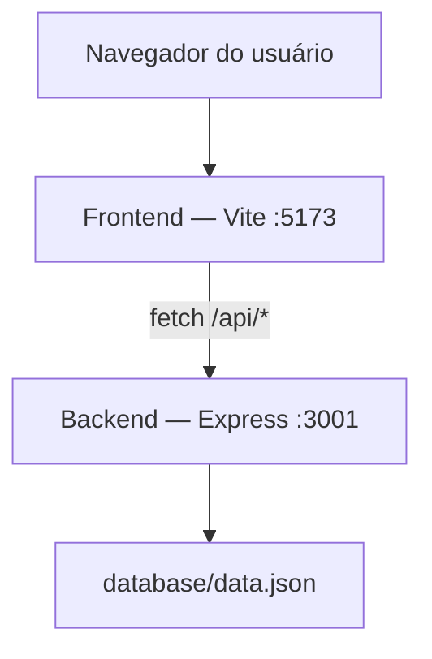
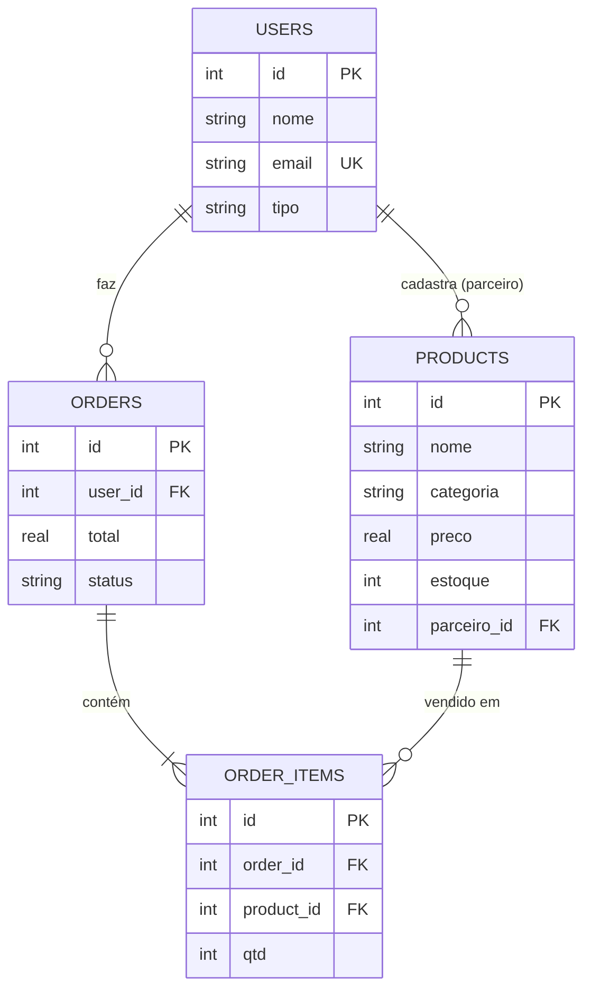
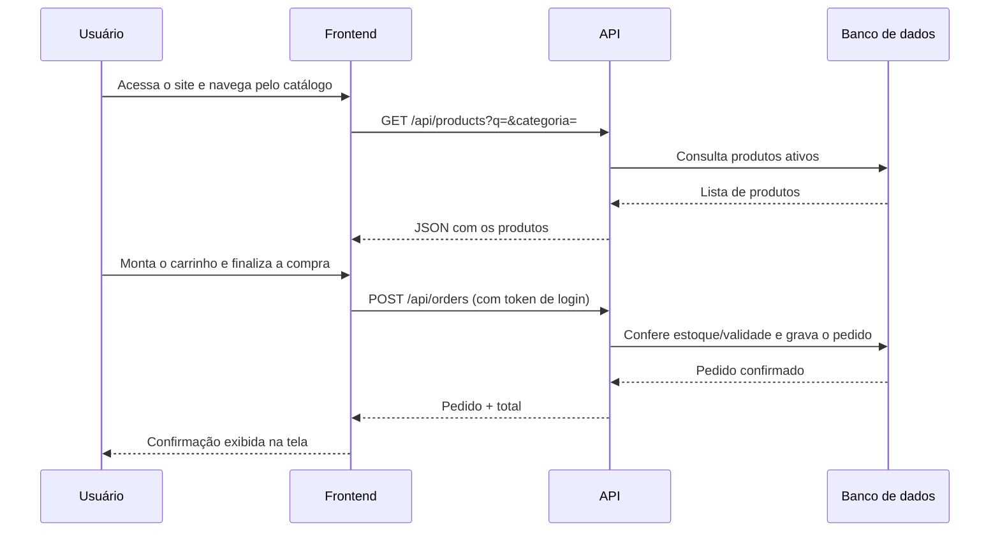

# Documento do Sistema — Smart Bag

## Capa

- **Sistema:** Smart Bag — Do desperdício à sacola inteligente
- **Equipe:** *Ana Caroline de Oliveira Ferreira, Geovana de Santana dos Santos, Larissa Oliveira da Silva, Paulo Aldo de Oliveira Neto e Yasmin Santos Ribeiro*
- **Instituição:** SENAI Candeias
- **Professor orientador:** Adalberto Santana
- **Versão:** v1.0 — versão final para apresentação

## Integrantes da equipe

> *Ana Caroline de Oliveira Ferreira, Geovana de Santana dos Santos, Larissa Oliveira da Silva, Paulo Aldo de Oliveira Neto e Yasmin Santos Ribeiro*

| Nome | Função no projeto |
|---|---|
| **Ana Caroline de Oliveira Ferreira** | UI/UX Designer, Documentação Técnica e Apresentação |
| **Geovana de Santana dos Santos** | Desenvolvedora Full-stack, Banco de Dados (JSON/SQL) e Apresentação |
| **Larissa Oliveira da Silva** | Pesquisa de Mercado e Apresentação |
| **Paulo Aldo de Oliveira Neto** | Pesquisa de Mercado, Documentação Técnica e Apresentação |
| **Yasmin Santos Ribeiro** | Desenvolvedora Front-end, Layout e Apresentação |

## Descrição do projeto

Smart Bag é uma plataforma web que conecta supermercados e comércios locais de Candeias-BA a consumidores, dando visibilidade a produtos com validade próxima e vendendo-os com desconto antes que virem perda. O sistema tem três frentes que conversam entre si: uma landing page institucional, uma loja onde o consumidor compra, e um painel onde o parceiro (mercado) gerencia o próprio estoque.

## Problema identificado

Supermercados descartam regularmente produtos ainda próprios para consumo apenas porque estão perto da validade, gerando prejuízo financeiro para o comércio e desperdício de alimentos que poderiam ser aproveitados. Ao mesmo tempo, consumidores que buscam economizar não têm um canal simples para encontrar esses produtos com desconto.

## Objetivo da solução

Oferecer um marketplace local e simples de operar, onde:
- o parceiro cadastra rapidamente os itens perto do vencimento, com preço reduzido;
- o consumidor encontra, compra e retira ou recebe esses produtos;
- o desperdício vira faturamento em vez de prejuízo.

## Público-alvo

- **Consumidores** de Candeias-BA que quiram economizar nas compras do dia a dia.
- **Supermercados, mercearias, açougues, padarias e comércios locais** que queiram reduzir perdas de estoque.

## Justificativa do projeto

O desperdício de alimentos é um problema ambiental e econômico. Uma solução tecnológica simples, pensada para o comércio local, ajuda a fortalecer a economia da cidade, reduz o volume de lixo orgânico e amplia o acesso a alimentos de qualidade a preços menores — um ganho para os três lados: mercado, consumidor e meio ambiente.

## Tecnologias utilizadas

- **Front-end:** HTML5, CSS3, JavaScript (Vanilla), Vite
- **Back-end:** Node.js, Express
- **Comunicação:** Fetch API, autenticação por token
- **Persistência de dados:** arquivo estruturado (`data.json`), com modelo relacional documentado em SQL
- **Controle de versão:** Git/GitHub

## Arquitetura da aplicação



O front-end (páginas estáticas + JavaScript) roda separado do back-end (API REST). A comunicação acontece só por `fetch`, em JSON, nunca por recarregamento de página. Ver detalhes em `docs/ARCHITECTURE.md`.

## Estrutura do projeto

```
Projeto/
├── frontend/   index, login, dashboard, painel do parceiro, minha conta (HTML + CSS + JS)
├── backend/    API Express (rotas, middleware de autenticação, camada de dados)
├── database/   schema.sql, seed.sql, data.json
├── assets/     logo e imagens
├── docs/       esta documentação
├── README.md
└── package.json
```

## Modelo do banco de dados



Definição completa das tabelas, tipos e restrições em `database/schema.sql`.

## Principais funcionalidades

1. Cadastro e login (consumidor ou parceiro)
2. Catálogo com busca e filtro por categoria
3. Carrinho de compras e checkout (Pix, débito, crédito · retirada ou delivery)
4. Histórico de pedidos, com cancelamento
5. Painel do parceiro: CRUD completo de produtos
6. Edição de perfil e exclusão de conta
7. Formulário de contato
8. Modo escuro
9. Layout responsivo (celular, tablet, desktop)

## Requisitos funcionais

| Código | Requisito |
|---|---|
| RF01 | O sistema deve permitir cadastro e login de usuários (consumidor ou parceiro) |
| RF02 | O sistema deve listar produtos ativos, com estoque e dentro da validade |
| RF03 | O sistema deve permitir busca por nome e filtro por categoria |
| RF04 | O sistema deve permitir montar um carrinho e finalizar a compra |
| RF05 | O sistema deve conferir estoque e validade no servidor antes de confirmar um pedido |
| RF06 | O sistema deve exibir o histórico de pedidos do usuário logado |
| RF07 | O sistema deve permitir cancelar um pedido confirmado e repor o estoque |
| RF08 | O sistema deve permitir que um parceiro cadastre, edite e exclua seus próprios produtos |
| RF09 | O sistema deve permitir editar dados do perfil e excluir a conta |
| RF10 | O sistema deve permitir enviar uma mensagem de contato |

## Requisitos não funcionais

| Código | Requisito |
|---|---|
| RNF01 | A interface deve ser responsiva para celular, tablet e desktop |
| RNF02 | As senhas devem ser armazenadas com hash, nunca em texto puro |
| RNF03 | Toda operação de escrita deve validar os dados tanto no front quanto no back-end |
| RNF04 | O sistema deve informar mensagens de erro e sucesso claras ao usuário |
| RNF05 | A comunicação entre front e back deve usar exclusivamente Fetch API/JSON |
| RNF06 | O código deve ser organizado por responsabilidade (rotas, middleware, camada de dados) |

## Fluxo de funcionamento do sistema



## Imagens das telas

> Adicione os prints em `docs/imagens/` e referencie-os aqui, por exemplo:
> ``

- [ ] Página inicial (Home)
- [ ] Login e cadastro
- [ ] Dashboard / vitrine de produtos
- [ ] Carrinho e checkout
- [ ] Histórico de pedidos
- [ ] Painel do parceiro (CRUD de produtos)
- [ ] Minha conta

## Melhorias implementadas (evolução em relação à primeira versão)

A primeira versão do projeto era uma landing page estática, sem back-end nem persistência de dados. A partir dela, a equipe evoluiu o sistema para:

- Back-end próprio em Node.js/Express, com rotas organizadas por recurso
- Autenticação real (cadastro, login, sessão por token, dois tipos de conta)
- Banco de dados estruturado, com relacionamento entre usuários, produtos e pedidos
- CRUD completo de produtos, exclusivo para contas de parceiro
- Checkout com conferência real de estoque e validade no servidor
- Histórico de pedidos com cancelamento
- Edição e exclusão de conta
- Modo escuro
- Ajustes de responsividade para tablet

Ver histórico detalhado em `docs/CHANGELOG.md`.

## Possíveis evoluções futuras

- Integração com um provedor de pagamento real (Pix/cartão) em vez de apenas registrar a forma escolhida
- Papel de administrador para moderar parceiros e mensagens de contato
- Notificações por e-mail quando um produto está perto de vencer
- Avaliações e comentários dos consumidores sobre os produtos
- Relatórios e gráficos de vendas para o parceiro
- Migração de `data.json` para um banco de dados relacional (SQLite/PostgreSQL), usando o `schema.sql` já preparado
